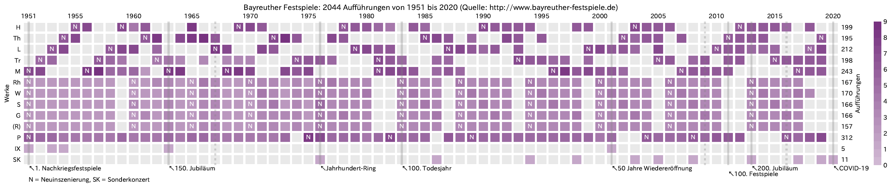

## Data Visualisations
```{r}

```
```{r out.width = '50%'}
knitr::include_graphics(c(
  "images/sparklinkwine_sankey.png",
  "images/wineries_in_japan_2019.png"
))
```
```{r out.width = '50%'}
knitr::include_graphics(c(
  "images/around_tokyo.png",
  "images/foodwaste_sankey.png"
))
```
```{r out.width = c('30%', '70%')}
knitr::include_graphics(c(
  "images/eraname_reiwa_filled.png",
  "images/PyHack100thAniv.png"
))
```

## Data Analyses
- [Toilet paper situations in the world](https://www.covid19analytics.org/post/toilet-paper-situations-in-the-world) (Global Data Science Project for COVID-19, published on 18th May 2020, updated in June 2020)
- [Wagner2Vek: Die Meistersinger von Nürnberg](Wagner2Vek_Meistersinger.html) (July 2019)
- [データで振り返る Python mini-Hack-a-thon 100回の歴史](Pyhack100thAniv.html) (June - July 2019)

## OSS
- [Matplotlib backend implementation for Optuna visualisation functions](https://github.com/optuna/optuna/pull/1756) (August 2020 - Now)
- [Japanese translation of a fast.ai article "Covid-19, your community, and you — a data science perspective"](https://www.fast.ai/2020/03/09/coronavirus/) (Published on 16th March 2020, updated on 19th March 2020)
- [Japanese translation of Stanford Cheat Sheets for ML, DL, Statistics](https://stanford.edu/~shervine/l/ja/teaching/) (with [MLT](https://mltokyo.ai/) members, August 2019 - Now)

## Talks
### R
- [初心者セッション：データ可視化](TokyoR/初心者セッション_データ可視化_TokyoR_20200801.pdf) (Tokyo.R, 1st August 2020)
- [日本の気象観測データの（オープンなようでオープンでない）話](TokyoR/日本の気象観測データの（オープンなようでオープンでない）話_TokyoR_20200627.pdf) (Tokyo.R, 27th June 2020)
- [国土数値情報APIのススメ](TokyoR/国土数値情報APIのススメ_TokyoR_20200404.pdf) (Tokyo.R, 4th April 2020)
- [Tidyverse（再）入門](TokyoR/Tidyverse（再）入門_JapanR_2019_20191207.pdf) (Japan.R, 7th December 2019)
- [ドイツのPyConでR（とPython）の話をしてきた話](TokyoR/ドイツのPyConでR（とPython）の話をしてきた話_TokyoR_82_20191026.pdf) (Tokyo.R, 26th October 2019)

### Python
- [データサイエンスのためのリーダブルコードのススメ](PyCon/PyCon_mini_Hiroshima/データサイエンスのためのリーダブルコードのススメ_PyCon_mini_Hiroshima_20201010.pdf) (PyCon mini Hiroshima, 10th October 2020)
- [Pythonでggplotってみた話](misc/Pythonでggplotってみた話_Pythonもくもく自習室_20200815.pdf) (Pythonもくもく自習室, 15th August 2020)
- [Pythonで見る私の行動変容 −COVID-19前後の比較−](PyCon/Python_Charity_Talks_in_Japan/Pythonで見る私の行動変容_−COVID-19前後の比較−_Python_Charity_Talks_in_Japan_20200704.pdf) (Python Charity Talks in Japan, 4th July 2020)
- [サンキーダイアグラムのススメ](PyData/サンキーダイアグラムのススメ_PyData_Fukuoka_20200607.pdf) (PyData Fukuoka, 7th June 2020)
- [Friend or Foe: Comparison of R & Python in Data Wrangling & Visualisation](PyConDE2019/Friend_or_Foe_Comparison_of_R_&_Python_in_Data_Wrangling_&_Visualisation_PyConDE_2019Oct.pdf) (PyCon DE & PyData Berlin 2019, 11th October 2019)

### Misc
- [オペラのお話](misc/オペラのお話_BPLL_20200616_公開用.pdf) (BeProud Learning Lunch, 16th June 2020)
- [AI Open Education: Stanford Deep Learning Cheat Sheets in Japanese](MLT/AI_Open_Education_Stanford_Deep_Learning_Cheat_Sheets_in_Japanese_MLT_CodeChrysalis_20191030.pdf) (Code Chrysalis x Machine Leearning Tokyo MiniConf, 30th October 2019)

### Archive
To be updated.